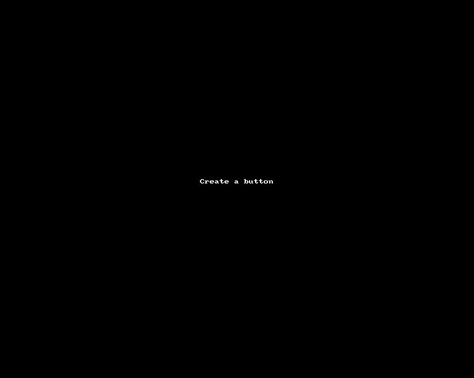
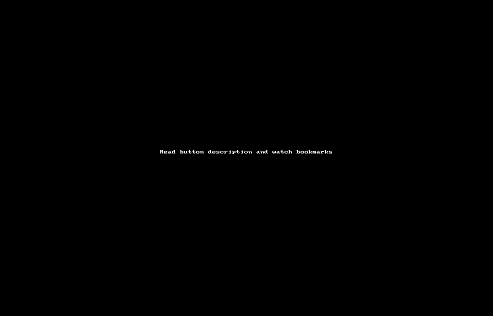
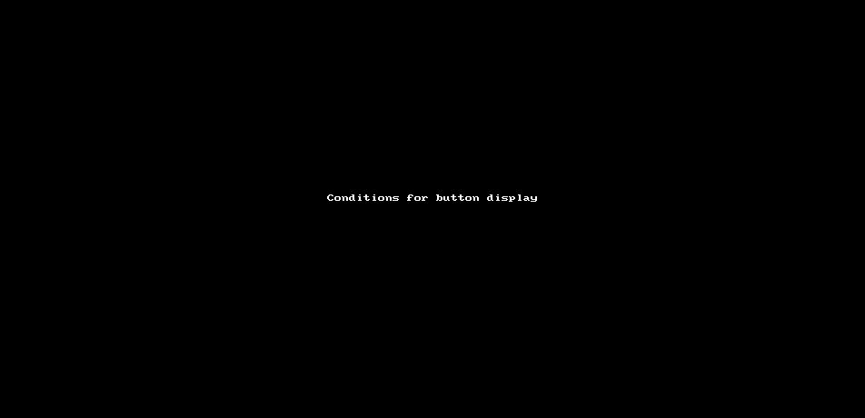

# MyButton 

The README file on this branch is dedicated to the WiP MyButton extension being made for the Nostr client Gossip.
The user get to make their own buttons which they can share if they want to.
Underneath you will find some quick presentations of demo-ready features.

# Create

You can create your own button and start tagging - your way.

It only takes a minute!

- Give your button a name

- Select an icon for it 

- Describe its purpose 

- Click "create" 

Once created, you'll find it next to the regular like-button.

In the first example, we create a button for tagging our music posts.

# List

After you start using your buttons, you will be able to browse your "likes".

Finding your old likes is easy and categorized, just select one of your buttons start browsing your old notes. 

In this example we browse through the notes we have tagged/bookmarked with our self-made buttons.

# Condition

You may want to have button sub-categories to further make it easy to find a note. 

In the advanced section you can setup conditions for when to show a button. 

To create a condition:

- Show advanced settings 

- Select the button you want to display on the condition that the note has a certain category.

- Select the category (another button) you want as condition.

- Click "show after this type"

In the example below we only show the K9 disc button for notes that have already be tagged as being sport.

# Fork

If you choose to, you can share the cool buttons you have created.

It is as simple as having it on your profile.

Forking is equally simple; just click on someone else button on their profile. 

On the example below we go a users profile and fork a button they are sharing by clicking on it.

Now you can find the forked button next to your own buttons and in the MyButton app. 

